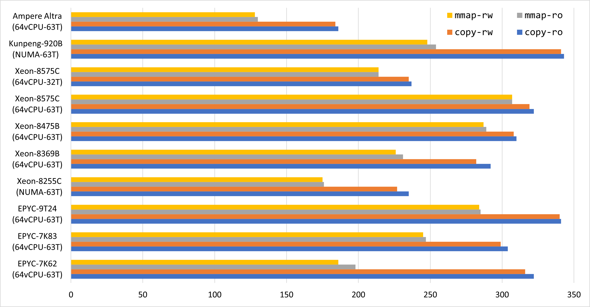
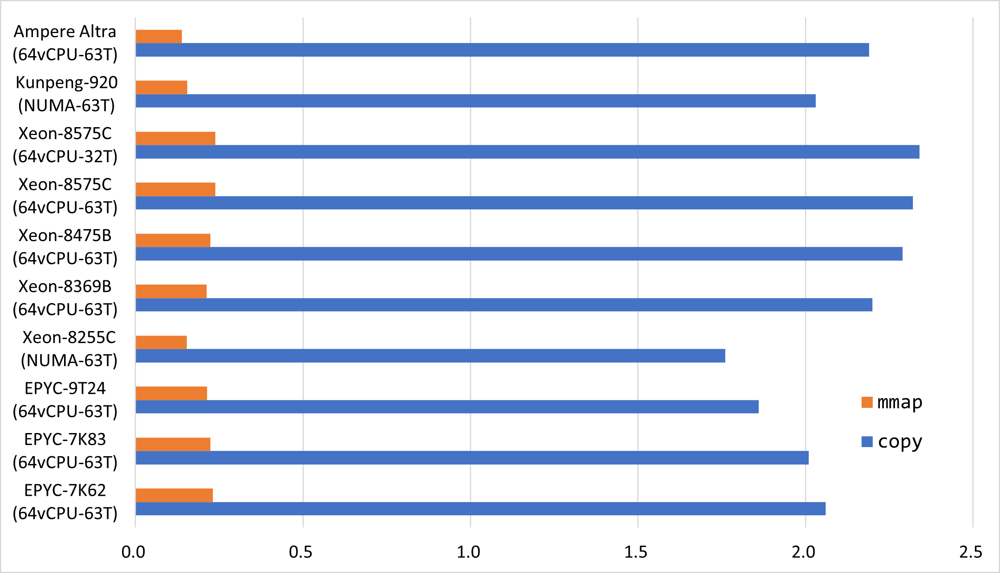
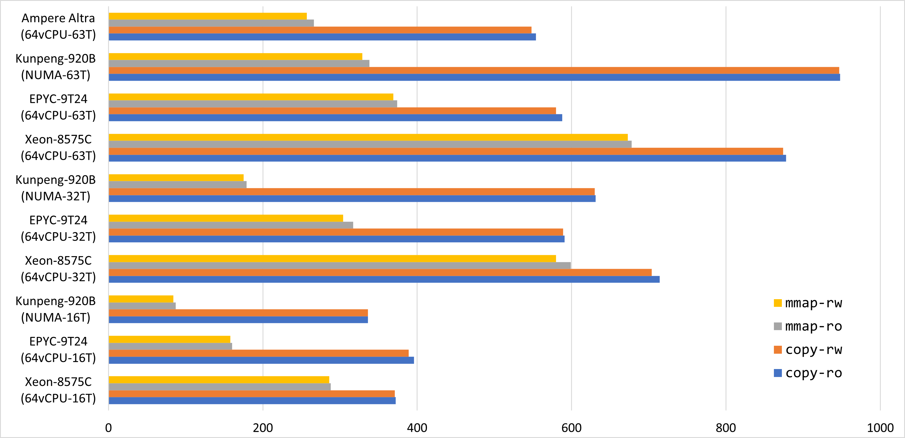
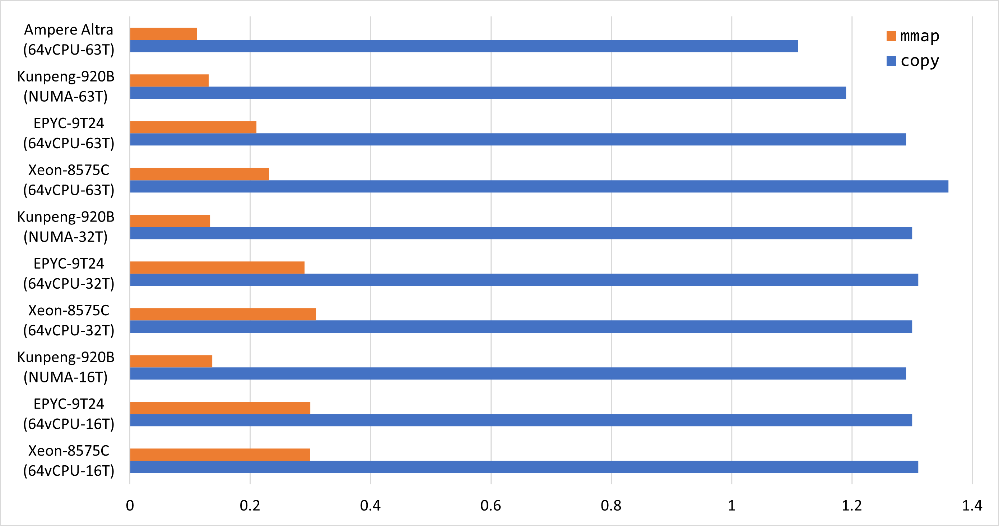

# 零丁洋
专为读多写少的场景优化的高性能KV字典。

单机可提供两亿QPS的读取性能（图中单位为百万）。

在放弃落盘的情况下写入QPS可以达两百万以上。

### 关键特性
* 无锁读取
* 较高的读取性能
* 支持变长键值数据
* 理论上存在小概率的失败
* 可以接受的空间开销（平均每项21字节+10%的数据大小）
* 要求CPU支持小端非对齐内存访问（X86、ARM、RISC-V等）

## 幸运版

单机可提供数亿QPS的读取性能（图中单位为百万）。

在放弃落盘的情况下写入QPS可以达百万以上。

### 关键特性
* 无锁读取
* 超高的读取性能
* 只支持定长键值数据
* 理论上不安全，但实际可用
* 合理的空间开销（平均每项10字节）
* 要求CPU支持小端非对齐内存访问（X86、ARM、RISC-V等）

## 只读解决方案
* [紧凑版](https://github.com/PeterRK/fastCHD)
* [极速版](https://github.com/PeterRK/SSHT)

---
[【中文】](README-CN.md) [【英文】](README.md)
