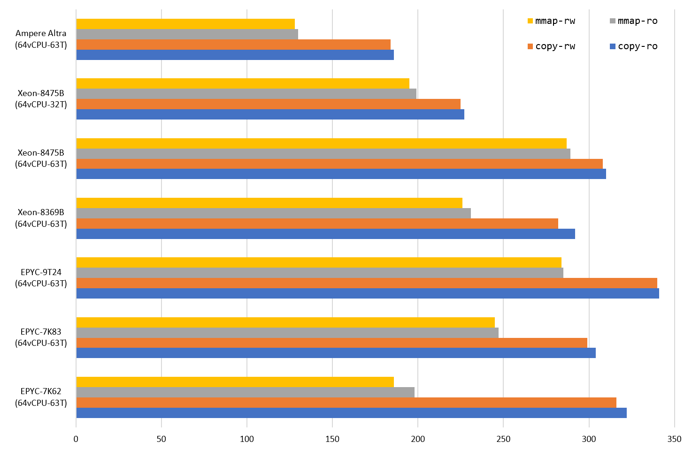
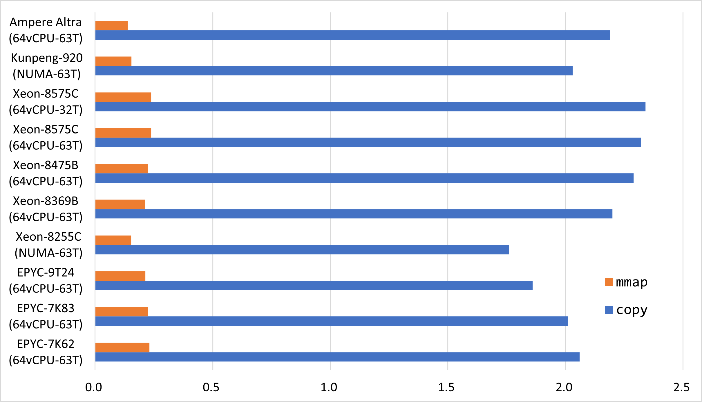
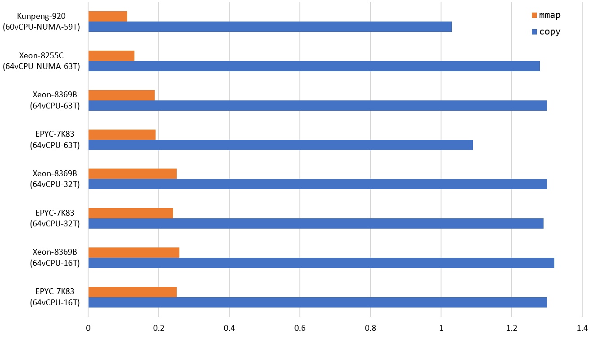

# Estuary
Dictionary designed for read-mostly scene.

It can provide up to 100M read QPS per machine.

And up to 250K QPS in the meantime.

Benchmark was done on Tencent cloud and Huawei cloud.

### Key Features
* fine-grained locking
* high read performance
* support key and value with variable length
* aceptable space overhead (ablout 25 bytes per item + 12.5% data size)
* work on CPU support little-endian unaligned memory access (X86，ARM，RISC-V...)

## The Lucky Version

It can provide up to half a billion read QPS per machine.

And more than one million write QPS without persistence.

### Key Features
* lock-free read
* very high read performance
* key and value should have fixed size
* actually work, but not be theoretically safe (we are usually lucky enough)
* resonable space overhead (ablout 10 bytes per item)
* work on CPU support little-endian unaligned memory access (X86，ARM，RISC-V...)

## Other Read-only Solutions
* [the one with extreme low space overhead](https://github.com/PeterRK/fastCHD)
* [the one with extreme read performance](https://github.com/PeterRK/SSHT)

---
[【Chinese】](README-CN.md) [【English】](README.md)
